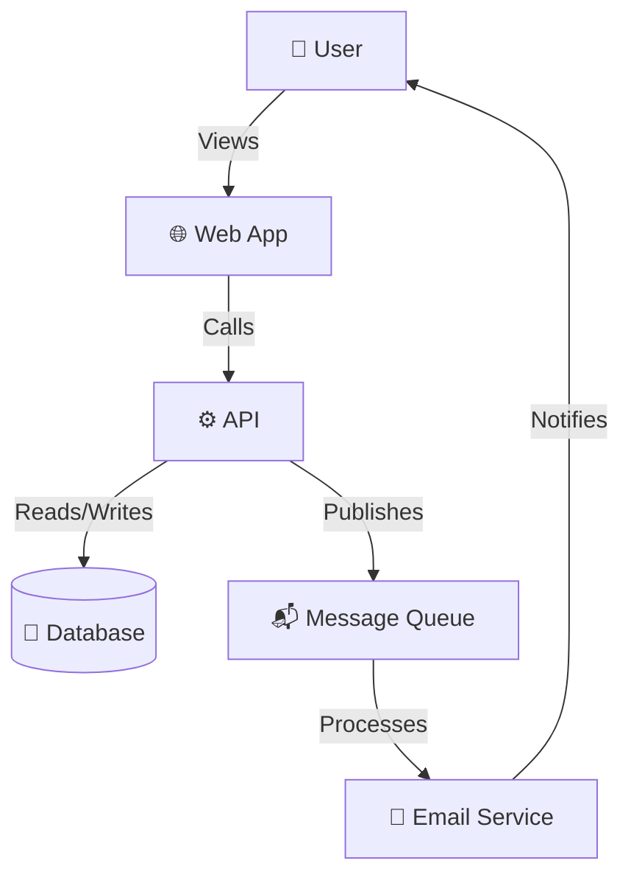
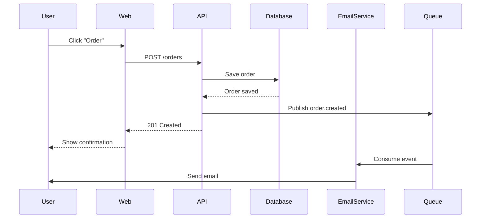

# Architecture Diagram Skill

## When to Use This Skill

- Creating system architecture diagrams
- Documenting component interactions
- Planning system deployments
- Creating visual specifications
- Documenting data flow
- Sequence diagrams for workflows
- Component relationship diagrams

## Quick Start

```
/architecture-diagram <system_or_component_to_diagram>
```

**Example**:
```
/architecture-diagram Microservices e-commerce platform with payment and order services
```

## How It Works

### C4 Model Hierarchy

**Level 1: System Context**
```
┌─────────────────────────────────────────────┐
│ Person: Customer                            │
└────────────┬────────────────────────────────┘
             │ Uses
             ▼
┌─────────────────────────────────────────────┐
│ Software System: E-Commerce Platform        │
│ Delivers online shopping functionality      │
└─────────────────────────────────────────────┘
             │ Sends emails via
             ▼
┌─────────────────────────────────────────────┐
│ Software System: Email System               │
└─────────────────────────────────────────────┘
```

**Level 2: Container**
```
┌──────────────────────────────────────┐
│ E-Commerce Platform                  │
├──────────────────────────────────────┤
│ ┌──────────────────────────────────┐ │
│ │ Web Application                  │ │
│ │ HTML/CSS/JavaScript              │ │
│ └──────────────────────────────────┘ │
│                                      │
│ ┌──────────────────────────────────┐ │
│ │ API Gateway                      │ │
│ │ Node.js                          │ │
│ └──────────────────────────────────┘ │
│                                      │
│ ┌──────────────────────────────────┐ │
│ │ Database                         │ │
│ │ PostgreSQL                       │ │
│ └──────────────────────────────────┘ │
└──────────────────────────────────────┘
```

**Level 3: Component**
```
┌────────────────────────────────────────┐
│ API Gateway                            │
├────────────────────────────────────────┤
│ ┌──────────────────────────────────┐   │
│ │ UserController                   │   │
│ │ Handles user endpoints           │   │
│ └──────────────────────────────────┘   │
│                                        │
│ ┌──────────────────────────────────┐   │
│ │ OrderController                  │   │
│ │ Handles order endpoints          │   │
│ └──────────────────────────────────┘   │
│                                        │
│ ┌──────────────────────────────────┐   │
│ │ AuthMiddleware                   │   │
│ │ Validates JWT tokens             │   │
│ └──────────────────────────────────┘   │
└────────────────────────────────────────┘
```

**Level 4: Code**
```
Class UserService {
  + findById(id: string): User
  + create(data: UserInput): User
  + update(id: string, data: UserInput): User
  - validateEmail(email: string): boolean
}
```

### Mermaid Diagram Examples



### Sequence Diagram



## Best Practices

1. **Use C4 Model**: Hierarchical levels of abstraction
2. **Keep Simple**: Start with high level, drill down
3. **Multiple Views**: Different diagrams for different audiences
4. **Tools**: Mermaid, PlantUML, Draw.io
5. **Version Control**: Store diagrams in git
6. **Update Regularly**: Keep diagrams synchronized with code

## Integration with Other Skills

- **`system-design-doc`**: Visual architecture documentation
- **`architecture-review`**: Review with diagrams
- **`pattern-recommendation`**: Pattern visualization

