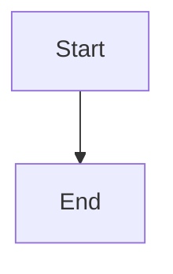

# Mermaid Diagrams for Technical Content

## When to Use This Skill

Use this skill when:
- Creating architecture diagrams for articles
- Drawing flowcharts and process flows
- Making UML diagrams (class, sequence, state)
- Creating entity-relationship diagrams
- Generating git graphs or timeline diagrams
- Building C4 model diagrams
- Creating sequence diagrams for APIs
- Making state machine diagrams
- Version controlling diagrams in Git
- Generating diagrams that can be embedded in Markdown

## Why Mermaid?

**Advantages:**
- ✅ **Text-based**: Version control friendly, shows diffs clearly
- ✅ **Simple syntax**: Learn in minutes, not hours
- ✅ **Markdown integration**: Embed in blog posts easily
- ✅ **Free**: Open source, no paid license
- ✅ **Wide support**: Works in GitHub, GitLab, Notion, many tools
- ✅ **Easy updates**: Change code, diagram updates instantly
- ✅ **Responsive**: Scales to device size automatically

**When to use instead of image:**
- Diagrams you'll update frequently
- When version control matters
- For documentation in Git
- When you want consistent styling
- For technical accuracy (not artistic)

## Mermaid Syntax Basics

### Basic Syntax Structure

```
mermaid
graph TD
    A[Start] --> B{Decision}
    B -->|Yes| C[Action 1]
    B -->|No| D[Action 2]
    C --> E[End]
    D --> E
```

### Diagram Types

#### 1. Flowchart (Most Common)

```
graph TD
    A[Process Start]
    B{Is Decision}
    C[Action if Yes]
    D[Action if No]
    E[Process End]

    A --> B
    B -->|Yes| C
    B -->|No| D
    C --> E
    D --> E
```

**Node types:**
- `[Rectangle]` - Process
- `{Diamond}` - Decision
- `([Stadium])` - Start/End (rounded)
- `[[Double rectangle]]` - Alternative process
- `[(Database)]` - Database
- `(Circle)` - Circle node

**Directions:**
- `graph TD` - Top down
- `graph LR` - Left to right
- `graph RL` - Right to left
- `graph BT` - Bottom to top

#### 2. Sequence Diagram (For APIs & Interactions)

```
sequenceDiagram
    participant User
    participant API
    participant Database

    User->>API: Request data
    activate API
    API->>Database: Query
    activate Database
    Database-->>API: Return data
    deactivate Database
    API-->>User: Send response
    deactivate API
```

**Elements:**
- `participant X` - Define participant
- `X->>Y: Message` - Synchronous call (solid arrow)
- `X-->>Y: Message` - Asynchronous return
- `X-xY: Message` - Lost message
- `activate X` / `deactivate X` - Activation box
- `alt` - Alternative flow
- `loop` - Loop
- `Note over X,Y` - Notes

**Best for:**
- API request/response flows
- Microservice interactions
- Protocol communication
- Multi-step transactions

#### 3. Class Diagram (For OOP Design)

```
classDiagram
    class User {
        int id
        string name
        email: string
        +login()
        +logout()
    }

    class Post {
        int id
        string title
        text: string
        date: DateTime
        +create()
        +publish()
    }

    User "1" --> "*" Post : creates
```

**Syntax:**
- `class Name { ... }` - Class definition
- `property: type` - Fields
- `+method()` - Public method
- `-method()` - Private method
- `#method()` - Protected method
- `Relationship` - Connection
- `"1" --> "*"` - Cardinality

**Best for:**
- Object-oriented design
- Domain models
- Entity relationships
- Design patterns visualization

#### 4. State Diagram (For State Machines)

```
stateDiagram-v2
    [*] --> Idle

    Idle --> Loading: loadData()
    Loading --> Loaded: onSuccess()
    Loading --> Error: onError()

    Loaded --> [*]
    Error --> Idle: retry()
```

**Syntax:**
- `[*]` - Start/end state
- `State --> State: Event` - Transition
- `State -->` - Transition without label
- `state Y { ... }` - Composite states

**Best for:**
- UI state flows
- Process states
- Lifecycle diagrams
- FSM visualization

#### 5. Entity Relationship Diagram (For Databases)

```
erDiagram
    CUSTOMER {
        int id
        string name
        string email
    }

    ORDER {
        int id
        int customer_id
        date order_date
    }

    PRODUCT {
        int id
        string name
        decimal price
    }

    CUSTOMER ||--o{ ORDER : places
    ORDER ||--|{ PRODUCT : contains
```

**Syntax:**
- `|o` - Zero or one
- `||` - One or many
- `o{` - One or more
- Entity definition with fields

**Best for:**
- Database schema
- Relational design
- Data model documentation

#### 6. C4 Diagram (For Architecture)

```
graph TB
    subgraph System
        Web[Web App]
        API[API Server]
        DB[(Database)]
    end

    User[User/Browser]
    External[External API]

    User -->|HTTP| Web
    Web -->|REST| API
    API -->|SQL| DB
    API -->|HTTP| External
```

**Best for:**
- System architecture (C4 Level 1)
- Container architecture (C4 Level 2)
- Component architecture (C4 Level 3)

#### 7. Git Graph (For Branching Strategy)

```
gitGraph commit id: "Initial"
    branch develop
    checkout develop
    commit id: "Feature start"

    branch feature/auth
    checkout feature/auth
    commit id: "Add login"
    commit id: "Add logout"

    checkout develop
    merge feature/auth

    checkout main
    merge develop tag: "v1.0"
```

**Best for:**
- Git workflows
- Release processes
- Branching strategy documentation

#### 8. Timeline (For Processes/Milestones)

```
timeline
    title Product Development Timeline
    2024-01 : Design complete
           : Prototype ready
    2024-02 : Backend development
           : Frontend development
    2024-03 : Testing phase
           : Bug fixes
    2024-04 : Launch : Marketing
```

**Best for:**
- Timelines
- Milestones
- Historical events
- Process phases

## Common Architecture Diagrams in Mermaid

### Monolithic Architecture

```
graph TD
    Client[Client/Browser]
    LB[Load Balancer]

    subgraph Monolith["Monolithic Application"]
        Web[Web Layer]
        Business[Business Layer]
        Data[Data Layer]
        Cache[Cache]
    end

    DB[(Database)]

    Client --> LB
    LB --> Web
    Web --> Business
    Business --> Data
    Business --> Cache
    Data --> DB
    Cache --> DB
```

### Microservices Architecture

```
graph TB
    Client[Client]
    APIGateway[API Gateway]

    subgraph Services
        UserService[User Service]
        OrderService[Order Service]
        ProductService[Product Service]
    end

    subgraph Databases
        UserDB[(User DB)]
        OrderDB[(Order DB)]
        ProductDB[(Product DB)]
    end

    MessageBroker[Message Broker]
    Cache[Cache/Redis]

    Client --> APIGateway
    APIGateway --> UserService
    APIGateway --> OrderService
    APIGateway --> ProductService

    UserService --> UserDB
    OrderService --> OrderDB
    ProductService --> ProductDB

    UserService --> MessageBroker
    OrderService --> MessageBroker
    ProductService --> MessageBroker

    Services --> Cache
```

### Event-Driven Architecture

```
graph TD
    EventSource[Event Sources]
    EventBroker["Event Broker<br/>(Kafka)"]

    subgraph Consumers
        Consumer1[Analytics Service]
        Consumer2[Notification Service]
        Consumer3[Search Indexer]
    end

    subgraph Storage
        Analytics[(Analytics DB)]
        Cache[Elasticsearch]
    end

    EventSource --> EventBroker
    EventBroker --> Consumer1
    EventBroker --> Consumer2
    EventBroker --> Consumer3

    Consumer1 --> Analytics
    Consumer2 --> Notifications[External]
    Consumer3 --> Cache
```

### API Request Flow

```
sequenceDiagram
    participant Client
    participant LoadBalancer as Load Balancer
    participant API as API Server
    participant Service as Business Service
    participant Cache as Redis Cache
    participant Database as PostgreSQL

    Client->>LoadBalancer: GET /api/users/123
    activate LoadBalancer
    LoadBalancer->>API: Route request
    deactivate LoadBalancer

    activate API
    API->>Cache: Check cache
    activate Cache
    Cache-->>API: Cache miss
    deactivate Cache

    API->>Service: getUserById(123)
    activate Service
    Service->>Database: SELECT * FROM users
    activate Database
    Database-->>Service: User data
    deactivate Database
    deactivate Service

    API->>Cache: Set cache
    API-->>Client: Return user data
    deactivate API
```

### Database Schema

```
erDiagram
    USERS {
        int id PK
        string email UK
        string password_hash
        string name
        timestamp created_at
        timestamp updated_at
    }

    POSTS {
        int id PK
        int user_id FK
        string title
        text content
        timestamp published_at
    }

    COMMENTS {
        int id PK
        int post_id FK
        int user_id FK
        text content
        timestamp created_at
    }

    USERS ||--o{ POSTS : creates
    USERS ||--o{ COMMENTS : writes
    POSTS ||--o{ COMMENTS : has
```

### Authentication Flow

```
sequenceDiagram
    participant User
    participant Client as Web Client
    participant AuthServer as Auth Server
    participant API as API Server
    participant Session as Session Store

    User->>Client: Login
    Client->>AuthServer: POST /login
    activate AuthServer
    AuthServer->>AuthServer: Verify credentials
    AuthServer->>Session: Create session
    AuthServer-->>Client: Return JWT token
    deactivate AuthServer

    Client->>API: API request + JWT
    activate API
    API->>API: Validate JWT
    API->>Session: Check session
    Session-->>API: Valid
    API-->>Client: Return data
    deactivate API
```

### Data Processing Pipeline

```
graph LR
    Raw[Raw Data]
    Ingest[Data Ingestion]
    Clean[Data Cleaning]
    Process[Data Processing]
    Store[Data Storage]
    Analyze[Analytics]
    Visualize[Visualization]

    Raw --> Ingest
    Ingest --> Clean
    Clean --> Process
    Process --> Store
    Store --> Analyze
    Analyze --> Visualize

    style Raw fill:#e1f5ff
    style Ingest fill:#e1f5ff
    style Clean fill:#fff3e0
    style Process fill:#fff3e0
    style Store fill:#f3e5f5
    style Analyze fill:#e8f5e9
    style Visualize fill:#e8f5e9
```

## Mermaid Styling

### Basic Styling

```
graph TD
    A[Important Node]
    B[Standard Node]

    style A fill:#ff6b6b,stroke:#c92a2a,color:#fff
    style B fill:#e7f5ff,stroke:#1971c2
```

**Color options:**
- `fill:#hexcolor` - Background color
- `stroke:#hexcolor` - Border color
- `color:#hexcolor` - Text color
- `stroke-width:3px` - Border thickness

### Class-Based Styling

```
classDef success fill:#90EE90,stroke:#228B22,color:#000
classDef error fill:#FF6B6B,stroke:#C92A2A,color:#fff
classDef warning fill:#FFD700,stroke:#FF8C00,color:#000

class A success
class B error
class C warning
```

## Best Practices for Mermaid Diagrams

✅ **Do:**
- Keep diagrams simple and focused
- Use clear, descriptive labels
- Consistent styling and color scheme
- Test in your target platform (GitHub, Markdown editor)
- Version control the diagram code
- Use comments to explain complex sections
- Match diagram to article text

❌ **Avoid:**
- Too many nodes/connections (hard to read)
- Unclear labels or arrows
- Inconsistent styling
- Making diagrams too complex
- Poor color contrast
- Overcrowding information

## Embedding Mermaid in Markdown

### In Markdown Files

````markdown

````

### In HTML/Web

```html
<pre class="mermaid">
graph TD
    A[Start]
    B[End]
    A --> B
</pre>

<script src="https://cdn.jsdelivr.net/npm/mermaid/dist/mermaid.min.js"></script>
<script>mermaid.initialize({ startOnLoad: true });</script>
```

### In Blog Posts

- **GitHub**: Works natively in markdown files
- **GitLab**: Works natively in markdown
- **Notion**: Use as code block (mermaid)
- **Medium**: Export as SVG/PNG
- **Dev.to**: Export as image
- **Custom blogs**: Include mermaid.js library

## Tools & Resources

- **Mermaid Live Editor**: https://mermaid.live (test diagrams)
- **Mermaid Documentation**: https://mermaid.js.org
- **GitHub Mermaid Support**: Native in markdown
- **VS Code Plugin**: "Markdown Preview Mermaid Support"
- **Online Editors**: Multiple options for testing

## Diagram Generation Workflow

### For Article Diagrams (15-20 min)

1. **Plan structure** (3 min)
   - What type of diagram?
   - What components?
   - What relationships?

2. **Write Mermaid code** (7-10 min)
   - Start with basic structure
   - Add all nodes
   - Add connections
   - Test in Mermaid Live Editor

3. **Refine and style** (3-5 min)
   - Adjust colors
   - Improve labels
   - Optimize layout
   - Add comments

4. **Export/embed** (2 min)
   - Copy code to article
   - Or export as SVG/PNG
   - Test in target platform

### For Complex Diagrams (30-45 min)

1. **Sketch on paper** (10 min)
2. **Plan data flow** (5 min)
3. **Code in Mermaid** (15-20 min)
4. **Iterate and refine** (5-10 min)
5. **Export and test** (5 min)

## Mermaid Diagram Types Checklist

- [ ] Flowchart - Process flows, decision trees
- [ ] Sequence - API interactions, protocols
- [ ] Class - OOP design, domain models
- [ ] State - FSM, UI states
- [ ] ER - Database schemas
- [ ] C4 - Architecture levels
- [ ] Git - Branching strategies
- [ ] Timeline - Milestones, processes

## Common Mermaid Mistakes to Avoid

❌ **Too complex**: Keep it simple, readable
❌ **Poor labels**: Make connections clear
❌ **No subgraph grouping**: Group related components
❌ **Bad colors**: Ensure contrast and consistency
❌ **Circular dependencies**: Usually indicates design issue
❌ **Inconsistent styling**: Use consistent approach
❌ **Not responsive**: Test on mobile
❌ **Version control**: Use code, not images

---

This skill works best combined with:
- **diagram-plantuml** for UML diagrams
- **architecture-design** for system architecture
- **sr-tech-blog** or other platform skills
- **markdown-formatter** for embedding in articles
- **image-generator-blog** for export as PNG/SVG
