# PlantUML Diagrams for Technical Content

## When to Use This Skill

Use this skill when:
- Creating detailed UML class diagrams
- Drawing complex sequence diagrams with advanced features
- Making deployment and infrastructure diagrams
- Designing component architecture
- Creating state machines with detailed transitions
- Building use case diagrams
- Making activity diagrams
- Combining multiple diagram types
- Needing professional-grade UML documentation

## Mermaid vs PlantUML

| Feature | Mermaid | PlantUML |
|---------|---------|----------|
| **Simplicity** | Very simple | More complex |
| **UML Support** | Basic | Full UML 2.5 |
| **Learning curve** | Minutes | Hours |
| **Diagram types** | 8 types | 12+ types |
| **Customization** | Limited | Extensive |
| **IDE support** | Good | Excellent |
| **Styling** | Limited | Advanced |
| **Processing** | Client-side | Server/Client |
| **Speed** | Fast | Slower for complex |

**Use Mermaid for:**
- Quick flowcharts and architecture
- Simple diagrams that don't need full UML
- Blog posts and documentation
- When GitHub integration matters

**Use PlantUML for:**
- Complex UML class diagrams
- Enterprise architecture documentation
- Detailed design specifications
- When precision and standards matter

## PlantUML Diagram Types

### 1. Class Diagram (Most Common)

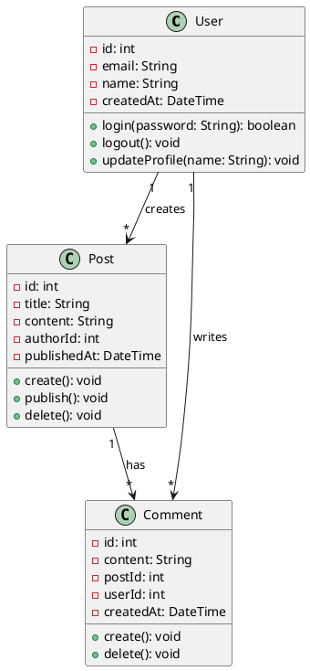

**Syntax:**
- `class Name { }` - Class definition
- `- field: Type` - Private field
- `# field: Type` - Protected field
- `+ method(): Type` - Public method
- `{static}` - Static member
- `{abstract}` - Abstract
- `"1" --> "*"` - Relationships with cardinality

**Relationship types:**
- `-->` - Association
- `|--` - Inheritance
- `*--` - Composition
- `o--` - Aggregation
- `..>` - Dependency
- `--` - Realization

**Best for:**
- Object-oriented design
- Domain models
- API design documentation
- Database schema
- Design patterns

### 2. Sequence Diagram (Advanced)

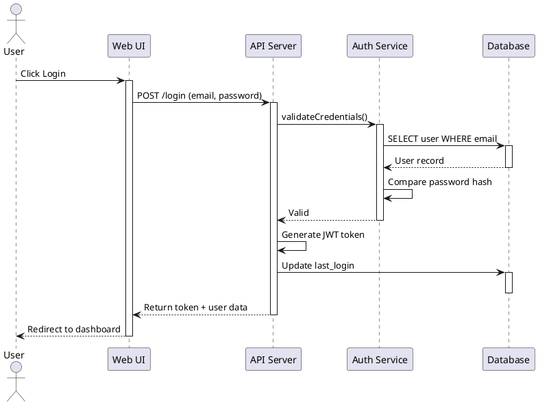

**Syntax:**
- `participant X` - Define participant
- `actor X` - Define actor
- `X -> Y: Message` - Synchronous call
- `X --> Y: Message` - Return/response
- `X ->> Y` - Asynchronous
- `activate X / deactivate X` - Activation box
- `alt / else` - Alternative
- `loop / end` - Repetition
- `par / end` - Parallel
- `note over X` - Notes
- `group` - Grouping

**Best for:**
- API flows
- Microservice interactions
- Request/response cycles
- Complex interactions
- Protocol sequences

### 3. Use Case Diagram

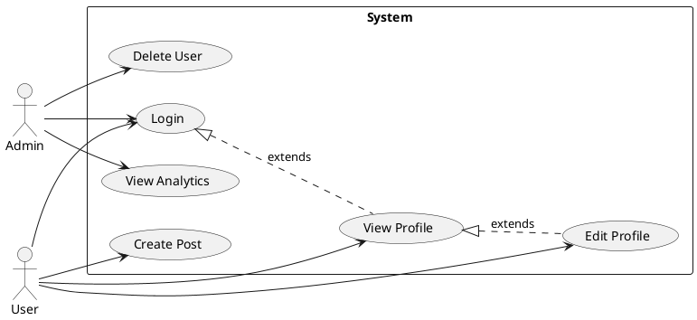

**Syntax:**
- `actor X` - User/actor
- `(Use Case)` - Use case
- `rectangle` - System boundary
- `X --> Y` - Association
- `X ..> Y : includes` - Include relationship
- `X <|.. Y : extends` - Extend relationship

**Best for:**
- User stories and requirements
- System capabilities
- Feature sets
- User interactions

### 4. State Diagram

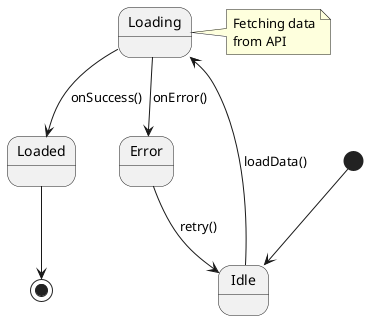

**Syntax:**
- `[*]` - Start/end state
- `X --> Y: Event` - Transition
- `state X { ... }` - Composite state
- `---` - Separator
- `note right/left/top/bottom of X` - Notes

**Best for:**
- State machines
- UI flows
- Process states
- Lifecycle diagrams

### 5. Component Diagram

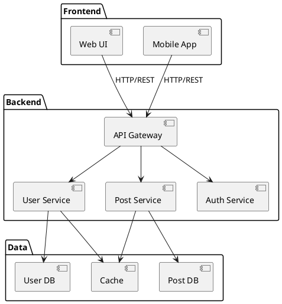

**Syntax:**
- `[Component]` - Component
- `package "Name" { ... }` - Package/grouping
- `X --> Y` - Dependency
- `X -- Y` - Connection

**Best for:**
- System architecture
- Component dependencies
- Technology stack layout
- Service organization

### 6. Deployment Diagram

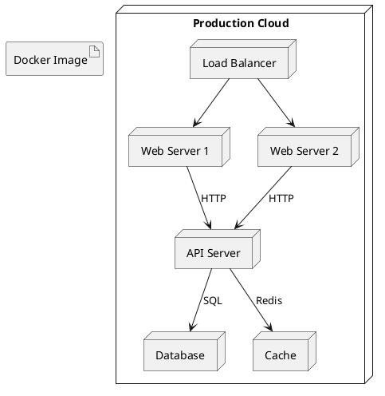

**Syntax:**
- `node "Name"` - Physical node
- `artifact` - Artifact (code, image)
- `X --> Y` - Dependency
- `X -- Y` - Connection

**Best for:**
- Infrastructure
- Deployment architecture
- Cloud setup
- Physical system layout

### 7. Activity Diagram

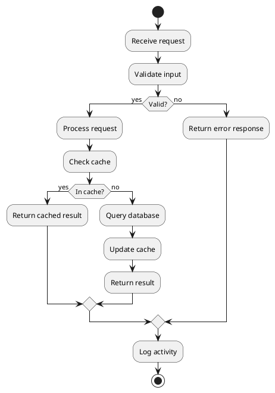

**Syntax:**
- `:Activity;` - Action
- `start / stop` - Flow boundaries
- `if (condition) then (yes) ... else (no) ... endif` - Decision
- `fork / join` - Parallelism
- `note` - Annotations

**Best for:**
- Process flows
- Business processes
- Algorithms
- Workflow visualization

### 8. Object Diagram

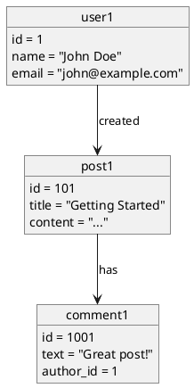

**Best for:**
- Instance diagrams
- Concrete examples
- Data state snapshots

## Common Architecture Patterns in PlantUML

### MVC Architecture

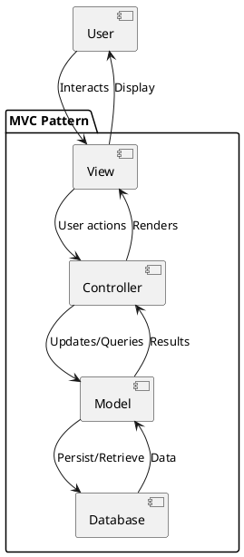

### Microservices Architecture

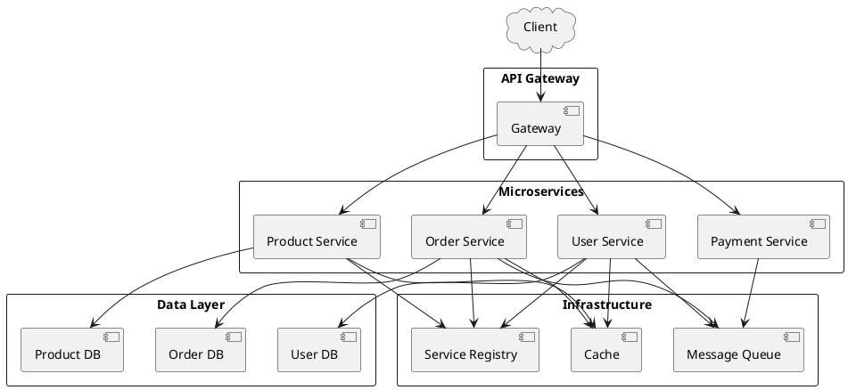

### Hexagonal (Ports & Adapters)

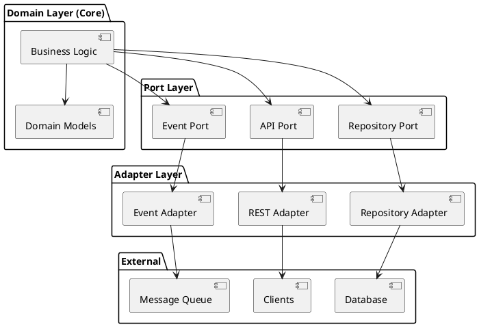

## PlantUML Styling

### Basic Styling

```plantuml
@startuml Styling

skinparam backgroundColor #f0f0f0
skinparam classBackgroundColor #e1f5ff
skinparam classBorderColor #0277bd
skinparam classArrowColor #0277bd
skinparam actorBackgroundColor #c8e6c9
skinparam note {
    backgroundColor #fff9c4
    borderColor #f9a825
}

class MyClass {
    + field1: String
    + method1(): void
}

@enduml
```

**Common skinparams:**
- `backgroundColor` - Overall background
- `classBackgroundColor` - Class fill
- `classBorderColor` - Class border
- `fontSize` - Font size
- `fontColor` - Text color
- `arrowColor` - Arrow color

### Color Schemes

```plantuml
skinparam class {
    BackgroundColor<<Business>> #e8f5e9
    BackgroundColor<<Data>> #e3f2fd
    BackgroundColor<<Presentation>> #fff3e0
    BorderColor #424242
}

class UserController<<Presentation>> { }
class UserService<<Business>> { }
class UserRepository<<Data>> { }
```

## PlantUML Setup & Tools

### Online Editors
- **PlantUML Online Editor**: https://www.plantuml.com/plantuml/uml/
- **Plant Text**: https://www.planttext.com/
- **Live Server**: Multiple options available

### IDE Support
- **VS Code Plugin**: "PlantUML"
- **IntelliJ/PyCharm Plugin**: Built-in PlantUML support
- **Sublime Text Plugin**: UML diagram plugin
- **Eclipse Plugin**: Available through marketplace

### Installation (CLI)
```bash
# macOS
brew install plantuml

# Generate PNG from file
plantuml diagram.puml

# Generate SVG
plantuml -tsvg diagram.puml
```

### Integration Options
- **GitHub**: Requires conversion to SVG/PNG
- **GitLab**: Native support coming
- **Markdown tools**: Use with mermaid-style blocks
- **Static site generators**: Hugo, Jekyll plugins available

## PlantUML vs Mermaid: When to Use

### Use Mermaid When:
- ✅ Simple diagrams (flowcharts, basic class diagrams)
- ✅ GitHub/GitLab native support important
- ✅ Want fastest implementation
- ✅ Blog posts and quick documentation
- ✅ Multiple simple diagrams

### Use PlantUML When:
- ✅ Complex UML diagrams needed
- ✅ Precise standard notation required
- ✅ Enterprise documentation
- ✅ Advanced styling and customization
- ✅ Detailed class hierarchies
- ✅ Complex sequence diagrams

## Diagram Generation Workflow

### For PlantUML Diagram (20-30 min)

1. **Analyze structure** (5 min)
   - What relationships exist?
   - What are the components?
   - What level of detail?

2. **Code the diagram** (10-15 min)
   - Define classes/components
   - Add relationships
   - Add styling

3. **Refine and test** (3-5 min)
   - Check in viewer
   - Adjust layout
   - Improve readability

4. **Export** (2 min)
   - As SVG or PNG
   - Embed in article
   - Or use raw code if platform supports

## PlantUML Diagram Checklist

- [ ] Clear, descriptive names
- [ ] Appropriate diagram type for content
- [ ] Relationships clearly shown
- [ ] Proper cardinality/multiplicity
- [ ] Consistent styling
- [ ] Not too complex/crowded
- [ ] Legend if needed
- [ ] Matches article narrative
- [ ] Tested in target platform
- [ ] Accessible (not image-only)

## Best Practices for Beautiful, Readable PlantUML Diagrams

### Readability Rules (Always Follow)

✅ **Do:**
- Keep diagrams focused on ONE architectural or design concern
- Use clear, descriptive names (avoid single letters except for very standard notation)
- Apply consistent color scheme and styling throughout
- Test in your target platform and export format
- Use meaningful comments to explain complex relationships
- Provide legends for all custom styling or notation
- Use proper packages/grouping to organize related components
- Ensure text is readable (min 10pt font, good contrast)
- Break complex diagrams into multiple simpler diagrams
- Use spacing to reduce visual clutter
- Color-code by logical layer or responsibility

❌ **Avoid:**
- Too many classes/components (max 20-25 elements per diagram)
- Single-letter or cryptic names (MyClass vs M)
- Inconsistent styling or theme application
- Circular dependencies without clear purpose
- Mixing abstraction levels (don't mix high-level architecture with implementation details)
- Forgetting legend (always explain custom styling)
- Deep package nesting (max 2-3 levels)
- Using colors alone for meaning (add icons/labels)
- Poor contrast or tiny fonts
- Cramped layout with overlapping elements

### Legend Implementation (Required)

**Always include a legend that documents:**
- What each color represents (by layer, type, or responsibility)
- What each visual style represents (line styles, stereotypes)
- Any special notation not immediately obvious
- Component type meanings (interface, abstract, concrete, etc.)

**Legend format in markdown (accompanying diagram):**
```markdown
## Architecture Legend

| Element | Meaning |
|---------|---------|
| **Green** | User-facing components |
| **Blue** | Business logic / services |
| **Purple** | Data access layer |
| **Orange** | External integrations |
| **Dashed line** | Async communication |
| **Solid line** | Direct dependency |
```

**In-diagram legend (using notes):**
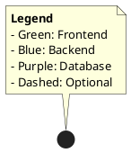

### Visual Design Rules

**Color scheme options (choose ONE and apply consistently):**

1. **Professional Layered** - Best for enterprise architecture
   ```
   Frontend/UI:     #E8F4F8 (light blue)
   Business Logic:  #D4E8F0 (medium blue)
   Data Layer:      #C0D8E8 (darker blue)
   External:        #F0E8D8 (gold)
   ```

2. **Semantic Colors** - Best for component diagrams
   ```
   Interface:       #90EE90 (green)
   Service:         #87CEEB (sky blue)
   Repository:      #DDA0DD (plum)
   Utility:         #F0E68C (khaki)
   External:        #FFB6C1 (light pink)
   ```

3. **Modern Gradient** - Best for sequence diagrams
   ```
   Actor:           #4C6EF5 (primary)
   System:          #5C7CFA (accent)
   Database:        #748FFC (lighter)
   External:        #F06595 (secondary)
   ```

**PlantUML styling template:**
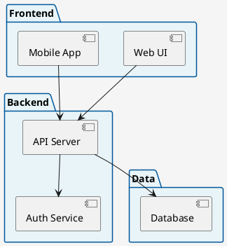

### Naming Conventions

✅ **Good names:**
- `UserAuthenticationService` (clear, specific)
- `OrderRepository` (role is evident)
- `PaymentGatewayAdapter` (type and purpose clear)
- `ProductCatalogAPI` (specific service)

❌ **Poor names:**
- `Service1`, `Service2` (meaningless)
- `X`, `Y`, `Z` (avoid single letters)
- `Helper`, `Manager`, `Processor` (too vague)
- `DomainModel` (which domain?)

### Element Count Guidelines

- **Class diagram**: Max 20-25 classes
- **Component diagram**: Max 15-20 components
- **Sequence diagram**: Max 8-10 participants
- **Use case diagram**: Max 12-15 use cases
- **Deployment diagram**: Max 10-12 nodes

**If exceeding limits:** Split into multiple focused diagrams

### Diagram Verification Checklist

Before publishing any PlantUML diagram:
- [ ] Clear, specific names for all elements (no single letters)
- [ ] Consistent styling and color scheme applied
- [ ] Legend provided documenting all custom styling
- [ ] Appropriate diagram type for content (not forcing wrong type)
- [ ] Max element count not exceeded (or split into multiple diagrams)
- [ ] Relationships clearly labeled and meaningful
- [ ] Proper cardinality/multiplicity shown (for applicable diagrams)
- [ ] No circular dependencies (unless intentional and documented)
- [ ] Text readable (good contrast, min 10pt)
- [ ] Whitespace adequate (not cramped or cluttered)
- [ ] Matches article narrative and explanation
- [ ] Tested in PlantUML Live Editor
- [ ] Exported as high-quality SVG or PNG
- [ ] Accessible without relying on color alone

---

This skill works best combined with:
- **diagram-mermaid** for simple diagrams
- **architecture-design** for architectural content
- **java-content**, **python-content**, **javascript-content** for language-specific examples
- **sr-tech-blog** or **medium-optimizer** for publication
- **markdown-formatter** for embedding in articles
- **image-generator-blog** for export as PNG/SVG
