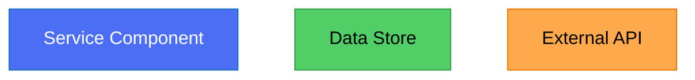

# DZone Article Publication Guide

## When to Use This Skill

Use this skill when:
- Writing articles for DZone publication
- Creating content for enterprise developer audience
- Publishing practical code tutorials and patterns
- Submitting to DZone editorial review process
- Optimizing for DZone's curation algorithm
- Creating articles with technical depth and business value

### Multi-Platform Strategy

When publishing same technical concept to multiple platforms (DZone, InfoQ, Medium, etc.):
- ✅ Use IDENTICAL code snippets linked to same GitHub repo (for consistency)
- ✅ Create UNIQUE title optimized for DZone audience (different from other platforms)
- ✅ Write UNIQUE content/narrative tailored to DZone's technical depth preference
- ✅ Match DZone's practical, production-focused style
- ✅ Different length/depth from other platform versions (DZone typically longer, more code-heavy)
- ✅ Different hook and community engagement call-to-action

**Example Multi-Platform Article:**
```
GitHub Repo: microservices-patterns-java (single source of truth for code)

DZone version:
  Title: "Circuit Breaker Pattern: When and Why Your System Needs It"
  Hook: "After implementing circuit breakers in production, I learned..."
  Focus: Practical implementation details, production concerns
  Length: 2000-4000 words
  Code: 2-4 production-grade examples from same GitHub repo
  CTA: "Share your resilience patterns in the comments"

InfoQ version:
  Title: "Resilience Patterns at Scale: Circuit Breaker Trade-offs and Implementations"
  Hook: "The industry is adopting circuit breaker patterns..."
  Focus: Research-backed analysis, architectural implications
  Length: 1500-3000 words
  Code: 1-2 examples from same GitHub repo (less code-heavy)
  CTA: "Link to original article for republishing"

Medium version:
  Title: "I Built a Circuit Breaker—Here's What I Learned"
  Hook: "When my production service started failing..."
  Focus: Personal journey, practical lessons
  Length: 2000-4000 words
  Code: Same examples from same GitHub repo
  CTA: "Follow for more technical stories"

Result: All versions link to IDENTICAL code in same repo
```

**Benefits:**
- Readers from all platforms reference same, well-maintained code
- Single GitHub repo becomes canonical source
- Increases code repository stars/visibility
- Reduces maintenance (one code version to keep current)
- Maximum reach with consistent technical substance

## DZone Platform Overview

**DZone** is a curated, community-driven platform for enterprise and software development articles. Unlike open platforms, DZone has strict editorial review and selective curation with mandatory human-written content.

- **Audience**: 2M+ monthly readers; senior developers, architects, tech leads, enterprise teams
- **Tone**: Professional, practical, business-aware, technical depth
- **Review**: Editorial review process (**30 business days** current timeline)
- **Moderation**: High editorial standards, strict content policies
- **Editorial support**: Editors polish grammar, formatting, clarity while preserving author voice
- **Reach**: Strong domain authority, community-driven curation
- **Profile focus**: Real human authors with expertise (no company accounts)

## DZone Article Specifications

### Length & Structure
- **MINIMUM**: **1000 words** (baseline requirement; DZone reserves right to reject if inadequate depth/value)
- **Preferred range**: 1,500-4,000 words (technical in-the-weeds content)
- **Target reading time**: 5-12 minutes
- **Headline**: 60-80 characters, specific and compelling
- **Sections**: 4-7 well-defined sections with H2/H3 headers
- **Content ratio**: DZone prefers **even balance of written text and code/diagrams** (not 20-30% code, but higher code-to-text than other platforms)
- **Images**: 2-4 relevant diagrams or screenshots
- **Image specifications**:
  - Format: JPEG/JPG recommended
  - Size: Compress to 100-200 KB per image
  - **Cumulative limit: 5MB per article** (exceeding causes save errors)
  - All images must have descriptive alt text
- **Code depth**: Technical content targeting developers directly with practical, production-grade examples
- **Key tip**: If covering multiple ideas, consider splitting into a series instead of one long article

**Multimedia submissions require accompanying text:**
- **Podcasts**: Include 800+ word text summary
- **YouTube videos**: Include 800+ word text summary
- **Presentations**: Include 800+ word text summary

### DZone Article Types

#### Tutorials/How-To
- Step-by-step implementation
- Production-ready code
- Real-world context
- Common pitfalls and solutions
- **Best for**: New frameworks, libraries, architectural patterns

#### Refactoring Guides
- Show problematic code
- Explain why it's problematic
- Present improved solution
- Discuss trade-offs
- **Best for**: Best practices, modernization, technical debt

#### Research & Analysis
- Data-driven insights
- Survey results or study findings
- Industry trends
- Metrics and benchmarks
- **Best for**: Thought leadership, industry perspectives

#### Interview/Expert Insights
- Q&A format
- Expert perspective
- Lessons from practitioners
- Real-world experiences
- **Best for**: Knowledge sharing, community building

#### Pattern Explanation
- Detailed pattern description
- When to use / when not to use
- Implementation example
- Production considerations
- **Best for**: Design patterns, architectural patterns, practices

### Headline Strategy for DZone

✅ **Good DZone headlines:**
- "Microservices Patterns: When to Use Circuit Breakers vs. Bulkheads"
- "Modern Java Concurrency: Virtual Threads and Structured Concurrency Explained"
- "Building Resilient Systems: Lessons From Netflix's Chaos Engineering"
- "Data Consistency in Distributed Systems: Event Sourcing in Production"
- "Python Async/Await: Understanding the Event Loop With Real Examples"

❌ **Avoid:**
- Vague: "Understanding Patterns"
- Clickbait: "One Weird Trick Developers Don't Know"
- Too trendy: "AI and Machine Learning: The Future is Now"
- Generic: "Best Practices in Java"

**Title formula:**
**[Topic] + [Specific Aspect/Challenge] + [Value/Learning]**

### Article Structure for DZone

```
HEADLINE (60-80 characters)
SUBHEADING/SUMMARY (100-150 characters, optional)

[Feature/Cover image - 1200x628px]

INTRODUCTION (250-400 words)
- Audience hook (who is this for?)
- Problem or context
- What you'll learn
- Unique angle or insight
- Promise of practical value

Section 1: Background/Context (300-500 words)
- Industry or business context
- Problem statement
- Why this matters now
- Common misconceptions
- Current state of practice

Section 2: Core Concept/Theory (400-600 words)
- Main idea explanation
- Principles and reasoning
- Architecture or design
- Why this approach is superior
- When it's applicable

Section 3: Implementation (600-900 words)
- Step-by-step walkthrough
- Production-grade code examples
- Configuration and setup
- Error handling and edge cases
- Testing strategies

Section 4: Real-World Example (500-700 words)
- Case study or scenario
- How the pattern/technique applies
- Metrics or results
- Lessons learned
- Challenges encountered

Section 5: Performance & Scalability (300-500 words)
- Benchmarks or measurements
- Resource implications
- Scaling characteristics
- Optimization opportunities
- Trade-offs to consider

Section 6: Best Practices & Pitfalls (400-600 words)
- Do's and don'ts
- Common mistakes
- Anti-patterns to avoid
- Maintenance considerations
- Team/organizational factors

CONCLUSION (200-300 words)
- Recap key insights
- Actionable takeaways
- When to use this approach
- Next steps or further learning
- Call to action

AUTHOR BIO (100-150 words)
- Professional background
- Current role/organization
- Expertise areas
- Social media/contact info
```

### Tone & Voice for DZone

- **Professional yet approachable**: Authoritative without being condescending
- **Practical focus**: Real code, real scenarios, real results
- **Business-aware**: Understand organizational and team context
- **Balanced perspective**: Acknowledge trade-offs and limitations
- **Data-driven**: Include metrics, benchmarks, evidence
- **Community-oriented**: Contribute to industry knowledge sharing

**Example voice:**
"After implementing microservices at three different companies, I've learned that success depends more on organizational structure than architectural patterns. Here's what we did differently at the third company that actually worked."

vs.

"Microservices are the solution to all scalability problems. Here's why you should adopt them immediately."

### Code Examples for DZone

#### Guidelines
- **Production-ready**: Code should be realistic, not educational simplifications
- **Complete**: Show full context, setup, and error handling
- **Tested**: Code has been verified to work
- **Current**: Use current framework versions and best practices
- **Explained**: Comment architectural decisions, not obvious code
- **Size**: Keep examples 30-50 lines max, link to full repos for more

#### Code Structure
```java
/**
 * Production example of the pattern discussed above.
 * Full source: https://github.com/author/repo
 */

@SpringBootApplication
public class ResilientServiceExample {

    // Implementation with production concerns
    // (error handling, logging, metrics)

    public static void main(String[] args) {
        SpringApplication.run(ResilientServiceExample.class, args);
    }
}
```

## Image Requirements for DZone Articles

### Diagram Requirements for DZone Articles

### Mermaid/PlantUML Diagrams (Always Include When Possible)

**CRITICAL RULE: Include Mermaid or PlantUML diagrams whenever conceptually relevant**

DZone readers strongly prefer well-designed diagrams that complement code examples. **Whenever possible, create diagrams.**

✅ **ALWAYS create diagrams for:**
- Architecture or system design explanations
- Process flows, decision trees, or workflows
- Database schema or data relationships
- API interactions or request/response cycles
- Microservices communication patterns
- State machines or lifecycle diagrams
- Sequence of operations or event flows
- Component dependencies or structure
- Comparison between approaches or solutions
- Performance or scaling concepts

✅ **Best diagram types for DZone technical articles:**
- **Flowchart** - Process flows, decision trees, algorithms
- **Sequence diagram** - API/microservice interactions, request-response
- **Architecture diagram** - System design, microservices patterns
- **Component diagram** - Service organization, dependencies
- **State diagram** - Workflow states, FSM, UI flows
- **ER diagram** - Database schema design
- **Class diagram** - OOP design, domain models

**Diagram Quality Standards (Non-Negotiable):**
- ✅ Beautiful, professional styling and colors
- ✅ Readable layout (max 15-20 nodes per diagram)
- ✅ Clear, descriptive labels for all elements
- ✅ **Legend provided** for all colors, symbols, or custom notation
- ✅ Consistent color scheme matching article theme
- ✅ Proper spacing and grouping
- ✅ Matches and reinforces article narrative precisely
- ✅ Styled with professional color palette
- ✅ Not cluttered or overcrowded
- ✅ Easy to understand at a glance

**When NOT to use diagrams:**
- ❌ When content is purely introductory (no concepts to diagram)
- ❌ When code example is self-explanatory (code IS the diagram)
- ❌ If making diagram would oversimplify complex concept
- ❌ Less than 3-4 logical components to show

### Creating Diagram Legends

**For every diagram, include a legend explaining styling:**

**Markdown legend template:**
```markdown
## Architecture Diagram Legend

| Element | Meaning |
|---------|---------|
| **Blue box** | Microservice component |
| **Green box** | Database/data store |
| **Orange circle** | External API |
| **Solid arrow** | Synchronous communication |
| **Dashed arrow** | Asynchronous/event-driven |
| **Red highlight** | Critical path or bottleneck |
```

**In-diagram legend (Mermaid example):**


### Image Generation Workflow

**Always generate images for your articles:**
1. Use `image-generator-blog` skill to create featured image
2. Create **Mermaid or PlantUML diagrams** for all conceptual content (REQUIRED when applicable)
3. Use `image-generator-blog` for custom graphics/comparisons if needed
4. Save ALL images to `/images` folder in article directory
5. Reference images in markdown with relative paths
6. **Include legend for each diagram**

### Images & Media

#### Featured Image

**Technical Specifications:**
- **Size**: 1200x628px (DZone standard) or 1024x768px (4:3 landscape)
- **Format**: JPG recommended for optimization
- **File size**: 500KB-2MB (compressed)
- **Quality**: Professional, high-resolution (96 DPI minimum)
- **Content**: Directly relevant to article topic

**Image Generation:**
- Create using `image-generator-blog` skill
- Must be original/custom (not generic stock photos)
- Abstract, futuristic, or technical aesthetic preferred
- Professional appearance reflects article quality

**Markdown Image Syntax:**
```markdown
# Article Title


## Introduction Section
Article content begins here...
```

**Save location:**
```
article-directory/
├── article.md
└── images/
    └── featured-image.jpg
```

#### In-Article Images
- **Frequency**: 2-4 images minimum (helps engagement and comprehension)
- **Types**:
  - Architecture diagrams (use `diagram-mermaid` or `diagram-plantuml`)
  - Flowcharts and process flows
  - Comparison matrices and decision tables
  - Metrics and benchmark graphs
  - Code visualization graphics

- **Quality**: Clear, legible, professional appearance
- **File format**: PNG for diagrams, JPG for photos
- **Size**: Compressed to 100-200KB each; cumulative max 5MB per article

**Markdown syntax for in-article images:**
```markdown
## Core Concept Section


*Figure 1: Microservices communication pattern with event broker.*

## Implementation Details

Here's the implementation approach...
```

**Image generation tools to use:**
- `diagram-mermaid` - For flowcharts, sequence diagrams, architecture
- `diagram-plantuml` - For UML diagrams, component diagrams
- `image-generator-blog` - For custom graphics, comparisons, infographics
- `architecture-diagram` - For C4 architecture models

#### Image Organization Best Practice
```
article-project/
├── article.md
├── images/
│   ├── featured-image.jpg (1200x628px)
│   ├── diagram-architecture.png
│   ├── diagram-sequence-flow.png
│   └── comparison-matrix.png
└── code-examples/ (optional)
    └── example-implementation.java
```

**Alt text requirement:**
```markdown

```
- Every image must have descriptive alt text
- Alt text improves accessibility and SEO
- Be specific: "Microservices architecture with service mesh" not just "diagram"

## Critical DZone Policies

### AI Content Policy
**No over-use of AI-generated content allowed**

- ❌ **Prohibited**: Articles with over-use of AI tools (ChatGPT, Claude, etc.)
- ❌ **Consequences**: Submission rejection + **potential account suspension**
- ✅ **Permitted**: Human-written articles with editorial support from DZone team

**Why DZone avoids AI-generated content (Official Stance):**
> "AI-generated content often lacks the depth, context, and personal touches that resonate with our audience."
> "We understand that AI can be a helpful tool, but when used improperly or excessively, it can dilute originality, introduce inaccuracies, and produce content that often feels generic and repetitive."
> "AI-generated articles tend to follow similar patterns and lack the unique voice or personal insights that resonate with readers — and yes, we can always tell!"

**Why you don't need AI to edit your articles:**
- DZone's editorial team edits and polishes your content for grammar, formatting, and clarity
- Editors are trained to maintain your perspective and voice
- Editorial team enhances your work while preserving your unique perspective
- Your authentic voice and personal insights are what readers value most

**What this means:**
- All article content must be written by you, a human
- DZone's editors will polish and refine your writing, but you must author the original content
- Trust DZone's editorial team to enhance your work without AI assistance

### Originality & Plagiarism Policy
- ✅ **Required**: Original, human-authored content
- ❌ **Not accepted**: Articles previously published elsewhere (syndicated articles deprioritized)
- ❌ **Plagiarism**: Copying others' words or ideas without proper attribution

**Plagiarism consequences:**
- **First violation**: Rejection + one warning + account flagged
- **Further violations**: Account suspension

**Check for plagiarism before submitting:**
- Use free tools like SmallSEOTools to verify originality
- Check DZone to ensure topic hasn't already been covered extensively
- Ensure all references to external materials are properly cited

**Note**: DZone prefers exclusive first-publication; original articles prioritized over syndicated

### Collaborative Articles
- ✅ **Allowed**: Multiple authors collaborating on one article
- **Requirement**: Every person who worked on the article must:
  - Have their own DZone account
  - Be listed as an author in the submission

### Republishing on Other Platforms
**After publication on DZone, you can republish elsewhere:**
- ⏰ **Wait at least one week** before republishing elsewhere
- 🔗 **Include canonical tag** pointing to DZone as original source:
  ```html
  <link rel="canonical" href="https://dzone.com/articles/[article-url]" />
  ```
- **Benefits of canonical tag:**
  - Proper credit attribution
  - Boosts your visibility
  - Directs traffic to original article
  - Builds your reputation
  - Avoids duplicate content issues with search engines
  - You're not competing with your own content

### Content Must NOT Include
- ❌ **Advertising or promotional intent** - No disguised vendor marketing
- ❌ **Marketing language or press releases**
- ❌ **Excessive backlinks or UTM tracking links**
- ❌ **Links to paid tools, products, or services**
- ❌ **Product feature lists or summaries**
- ❌ **Gated content or links to gated content**
- ❌ **Content solely to promote a product, service, or company**
- ❌ **Blurbs or incomplete articles that link off-site for full content**
- ❌ **Company account profiles** - Must be individual author with real name
- ❌ **Company logos in profile** - Personal brand only
- ✅ **Professional affiliation** - May mention employer, but article must be from your perspective

### Account Suspension: What Causes It
**When your account is suspended**, you can still view and read articles on DZone, but **you will NO LONGER be able to:**
- Submit articles
- Download premium publications

**Behaviors that cause suspension:**
- ❌ **Plagiarism** - Copying others' words/ideas without attribution (one warning, then suspension)
- ❌ **AI-generated content** - Fully or partially AI-written articles
- ❌ **Spam submissions** - Multiple spam submissions
- ❌ **Fake/duplicate/company profiles** - Using false identities or company accounts
- ❌ **Bullying or harassment** - Toward other users
- ❌ **Hate in articles or comments** - Posting hateful content
- ❌ **Spam comments** - Including links to products/services in comments

**Note:** All comments go through moderation on DZone.

### Profile Requirements
Your DZone profile MUST include:
- ✅ **Real name** - Not pseudonym or company name
- ✅ **Valid email address**
- ✅ **Current job title**
- ✅ **Professional headshot** (recommended for author bio)
- ❌ **NO company accounts** - Individual profiles only
- ❌ **NO company logo** - Personal branding only

### Image & Media Rights
You must own or have permission for all images:
- ✅ **Original images** - Created by you or your company
- ✅ **Licensed images** - With proper licensing rights
- ✅ **Permitted images** - Written permission from copyright holder
- ❌ **Stock photos without license** - Verify usage rights
- ❌ **Screenshots without attribution** - Credit original source

**Multimedia submissions require accompanying text:**
- **Podcasts**: Include 800+ word text summary
- **YouTube videos**: Include 800+ word text summary
- **Presentations**: Include 800+ word text summary

### Content Targeting
DZone looks for:
- ✅ **900+ words of technical, in-the-weeds content**
- ✅ **Even balance of written text and code/diagrams**
- ✅ **Content targeting developers directly**
- ✅ **Production-grade, practical examples**
- ✅ **Real-world lessons and experience**

### Review Timeline
- **Current timeline**: **30 business days**
- **Rejection email**: Automated + potential editor notes
- **Publication**: Typically 1-2 weeks after approval

### DZone Zones & Tagging

#### Zone Selection (Required: 1-10 zones)
Select relevant zones for your article:

**Primary zones:**
- Architecture
- Big Data
- Cloud
- Database
- DevOps
- Java
- JavaScript
- Microservices
- Performance
- Python
- Web Development

**Additional tags:**
- AI/ML
- Security
- Testing
- Tools & Libraries
- Best Practices

**Good zone selection strategy:**
1. Start with most relevant primary zone
2. Add language/framework zones
3. Add tools and techniques discussed
4. Add article type zone
5. Tag up to 10 total for good discoverability

#### Article Tags (3-6)
Choose tags that match DZone's curated interests:
- Language/Framework: `java`, `python`, `javascript`, `spring-boot`, `react`
- Architecture: `microservices`, `distributed-systems`, `cloud-native`
- Practice: `devops`, `performance`, `testing`, `security`
- Topic: `best-practices`, `tutorial`, `design-patterns`, `case-study`

**Avoid**: Too many tags, irrelevant tags, spammy tags

#### Article Zone (1 selection)
Select primary zone:
- Cloud
- Database
- DevOps
- Microservices
- Web Development
- Java
- Python
- JavaScript
- Big Data
- AI/ML
- Architecture
- Performance

## DZone Core Program & Contributors

### DZone Core Program
**Priority consideration for established, expert contributors:**
- **Recognition**: Title for most engaged and authoritative experts
- **Priority**: Core articles reviewed and published faster
- **Support**: Direct access to editorial team
- **Benefits**: Higher visibility, featured placement potential

**Characteristics of Core members:**
- Demonstrate ability to translate complex technical topics into accessible content
- Consistent quality, original perspective, deep technical knowledge
- Active community engagement and responsiveness to feedback
- Track record of well-received articles

### DZone Editorial Review Process

#### Before Submission
- [ ] Article is minimum 1200 words (preferably 1,500-4,000)
- [ ] Contains even balance of text and code/diagrams
- [ ] 2-4 production-grade code examples (tested and working)
- [ ] 2-4 supporting images with alt text and captions
- [ ] All claims are accurate and verifiable with evidence
- [ ] Code examples reflect production concerns (error handling, logging)
- [ ] Professional writing (no grammatical errors; editors will help refine)
- [ ] Unique, original perspective (not rehashing known content)
- [ ] NOT previously published elsewhere
- [ ] Author bio (100-150 words) and professional headshot ready
- [ ] 1-10 zones/topics identified
- [ ] No promotional or advertising intent
- [ ] All images owned or properly licensed

#### Submission Process
1. **Create DZone account** (must include real name, job title, valid email)
2. **Use Contribute section** to start submission
3. **Upload article**: Copy/paste or upload markdown/document
4. **Add metadata**: Zone (1 primary), tags (3-6), summary (150-250 chars)
5. **Include author info**: Bio, headshot, social profiles
6. **Flag any affiliations**: Conflicts of interest or company affiliation
7. **Verify content**: Confirm original and human-authored
8. **Submit for review**

#### Editorial Review Process

**Current Status:**
- **Overall queue timeline**: **30 business days** (extremely high volume, 400+ articles often in queue at once)
- **General timeframe**: 7-12 business days typically
- **Prioritization order**:
  1. **DZone Core Program articles** - Priority processing
  2. **Original content** - Syndicated articles deprioritized
  3. **Oldest articles in queue** - First-in, first-out for non-Core original content

**Processing stages:**
- All articles go through moderation process and editorial editing
- Timeline varies based on: article quality, article length, submission volume
- Editorial team polishes grammar, formatting, clarity while maintaining author voice

**Publication after approval:**
- Typically 1-2 weeks after final approval
- Automated email notification when published or rejected

#### What Causes Review Delays
These issues slow down the review process:
- ❌ **Syndicated articles** (original articles prioritized over syndicated)
- ❌ **Missing images or alt text** (images required, alt text for accessibility)
- ❌ **Grammar and spelling mistakes** (throughout the article)
- ❌ **Missing code or incorrect formatting** (code must be in code blocks/snippets)
- ❌ **Articles too long for publication** (split multi-topic articles into series)

#### If Rejected
- **Automated email**: Lists specific reasons for rejection with detailed explanation
- **Editor notes**: May include specific feedback from the editor
- **Review guidelines**: Refer back to these submission guidelines for clarification
- **Resubmit**: You can revise and resubmit, or create new article
- **Support**: Don't hesitate to reach out to **editors@dzone.com** for help

### Topics DZone Publishes Well

**Content types that do well on DZone:**
- ✅ **Tutorials** - Step-by-step with production-grade code
- ✅ **Cheat sheets and resources** - Quick reference guides
- ✅ **Career and lifestyle advice** - For technical professionals
- ✅ **Best practices** - Drawn from real experience

**High-value technical topics:**
1. **Production patterns**: Things that work in real systems at scale
2. **Modernization**: Updating legacy systems thoughtfully (with lessons)
3. **Architecture decisions**: Why companies chose certain paths + trade-offs
4. **Performance improvements**: Real benchmarks, before/after metrics
5. **Operational insights**: DevOps, monitoring, reliability, observability
6. **Testing strategies**: Unit, integration, contract, chaos, E2E
7. **Code quality**: Refactoring, technical debt, maintainability, standards
8. **Cloud-native**: Kubernetes, containers, serverless (practical approaches)
9. **Security practices**: Real-world security considerations, not theory
10. **Tool deep-dives**: Libraries, frameworks, solutions (hands-on experience)
11. **Language ecosystem**: Java, Python, JavaScript latest features and patterns
12. **Distributed systems**: Event-driven, microservices, eventual consistency

**Topics DZone DOES NOT ACCEPT (explicit off-topic list):**
- ❌ **SEO and search marketing**
- ❌ **UI/UX design principles** (design aesthetics, not UX development)
- ❌ **General business strategies or topics**
- ❌ **Web design concepts or aesthetics**
- ❌ **E-commerce strategies or tools**
- ❌ **Cryptocurrency or NFTs-related content**
- ❌ **Game development**
- ❌ **Unoriginal or duplicate articles** (check DZone first; check other platforms)

**Other topics to avoid:**
- ❌ **Generic "getting started"** tutorials (unless unique angle or depth)
- ❌ **Pure hype coverage** (AI, blockchain, web3 without substance)
- ❌ **Vendor marketing** (disguised promotions or single-tool focus)
- ❌ **Beginner-level content** (DZone audience knows fundamentals)
- ❌ **Extremely niche topics** (limited relevance to 2M+ readers)
- ❌ **Outdated framework versions** (must use current technology)
- ❌ **Unverified claims** (DZone expects evidence and metrics)

**What DZone editors look for:**
- ✅ **Technical depth** - In-the-weeds content, not surface level
- ✅ **Production experience** - Real lessons from real systems
- ✅ **Practical actionability** - Developers can apply immediately
- ✅ **Honest assessment** - Trade-offs and limitations acknowledged
- ✅ **Strong voice** - Unique perspective, not regurgitating documentation

### DZone vs. Medium vs. Dev.to

| Factor | DZone | Medium | Dev.to |
|--------|-------|--------|--------|
| **Audience** | Enterprise devs | Broad developers | Community developers |
| **Review** | Editorial | None | Community moderation |
| **Length** | 1500-4000 | 2000-7000 | 1000-3000 |
| **Tone** | Professional | Authoritative | Friendly |
| **Publication** | Curated | Algorithm | Algorithm |
| **Best For** | Patterns, insights | Deep dives | Quick wins |
| **Audience size** | 2M/month | Varies | 500k+/month |

### Writing Tips for DZone

#### Hook Readers Immediately
- **First sentence**: Must grab attention and promise value
- **Problem/solution framing**: Show the challenge upfront
- **Expertise signal**: Establish credibility early

**Example hook:**
"After scaling a system from 100 to 10,000 concurrent users, we discovered that our database optimization strategy was solving the wrong problem. Here's what we learned about identifying actual bottlenecks."

#### Back Up Claims
- **Metrics**: Include actual numbers, benchmarks
- **Data**: Reference studies or surveys
- **Experience**: Ground advice in real-world context
- **Links**: Reference authoritative sources

#### Balance Theory and Practice
- **Why it matters** (theory/reasoning)
- **How to do it** (practical implementation)
- **When to use it** (business/technical context)
- **What we learned** (real experience)

#### Use Examples Strategically
- **First example**: Simplest case, easiest to understand
- **Second example**: More complex, realistic scenario
- **Real-world example**: From production system
- **Anti-example**: Show what NOT to do

### Common DZone Mistakes to Avoid

**CRITICAL: Don't violate DZone's core policies**
- ❌ **AI-written content**: Any over use of AI generation = rejection + possible account suspension
- ❌ **Previously published**: Posted on blog, Medium, Dev.to, LinkedIn first
- ❌ **Non-human author**: Submitted by company account or non-author
- ❌ **Marketing intent**: Vendor promotion disguised as article
- ❌ **Image rights violation**: Using images without proper permissions

**Content & quality mistakes**
- ❌ **Insufficient depth**: DZone readers expect substance and technical rigor
- ❌ **Too short**: Under 1000 words unless truly exceptional
- ❌ **Poor code balance**: All text or all code; DZone wants even balance
- ❌ **Misleading headline**: Title doesn't match actual content
- ❌ **No production context**: Toy examples feel academic; missing error handling
- ❌ **Unverified claims**: No benchmarks, metrics, or evidence provided
- ❌ **Poor code examples**: Incomplete, untested, or outdated code
- ❌ **Grammar and spelling**: Reduces credibility (but editors will help refine)
- ❌ **No unique perspective**: Just regurgitating documentation
- ❌ **Overly trendy**: Hype-driven coverage without substance
- ❌ **Missing images**: Text-heavy articles get lower engagement
- ❌ **No real examples**: Case studies and production lessons expected

**Submission & process mistakes**
- ❌ **Wrong profile info**: Company account, no real name, or no job title
- ❌ **Missing zones/tags**: Under-categorized articles won't be discovered
- ❌ **No author bio**: Credibility signaling important for DZone
- ❌ **Inflammatory tone**: DZone removes content with inappropriate language
- ❌ **Too many grammatical errors**: Shows lack of effort (editors refine, not create)

### DZone Success Examples

**Example 1: Pattern Article**
**Headline:** "Circuit Breaker Pattern: When and Why Your System Needs It"

Opening: "Circuit breakers have saved us from cascading failures three times in production. Here's how they work and the exact scenarios where they matter."

Structure:
1. Background (why Netflix open-sourced Hystrix)
2. Problem (cascading failures, what they cost)
3. Pattern explanation (states and transitions)
4. Implementation (production code)
5. Real scenario (from our experience)
6. Performance (impact on latency, throughput)
7. Pitfalls (common mistakes)

Result: Likely to rank well, get bookmarks, generate discussion

**Example 2: Modernization Guide**
**Headline:** "Migrating From Monolith to Microservices: Lessons From Our Year-Long Journey"

Opening: "We spent a year breaking apart a 10-year-old monolith. This is what actually worked (and what didn't)."

Structure:
1. Context (company size, technology, constraints)
2. Why we needed to change (business and technical reasons)
3. Phase 1 (decomposition strategy)
4. Phase 2 (implementation and challenges)
5. Phase 3 (deployment and operations)
6. Metrics (performance, team velocity improvements)
7. Lessons (what we'd do differently)

Result: Practical, builds credibility, generates discussion

### Publication Tips

#### Timing
- **Avoid Mondays**: More competition
- **Tuesday-Thursday**: Better distribution
- **Avoid Fridays**: Less engagement over weekends

#### Promotion
- **Share on Twitter**: Tag DZone and relevant communities
- **LinkedIn**: Professional perspective and network
- **Dev communities**: Reddit, HackerNews (only if genuinely valuable)
- **Your network**: Email, Slack, Discord communities

#### Engagement
- **Monitor comments**: Respond to questions and feedback
- **Answer criticism**: Engaging debate increases reach
- **Thank for shares**: Build community relationship
- **Link to related**: Reference other articles on topic

### DZone Publishing Checklist

**CRITICAL: Before you start**
- [ ] **Article is human-written** (no over-use AI generation)
- [ ] **Original content** (not published on blog, Medium, Dev.to, or elsewhere)
- [ ] **No advertising intent** (pure educational/informational)
- [ ] **All images owned or properly licensed**
- [ ] **No company profile** (personal author account with real name)

**Content quality**
- [ ] Article is 1000+ words (rarely accepted below 1000)
- [ ] Optimal length 1,500-4,000 words
- [ ] Contains **even balance of text and code** (not 20-30% code)
- [ ] **2-4 production-grade code examples** (not toy examples)
- [ ] Code examples tested and verified working
- [ ] Code includes production concerns (error handling, logging, metrics)
- [ ] All technical claims backed by benchmarks, metrics, or evidence
- [ ] Real-world context and production lessons included
- [ ] Trade-offs and limitations honestly discussed
- [ ] Professional writing with clear structure

**Article structure & SEO**
- [ ] Headline is specific and compelling (60-80 chars)
- [ ] Article has 4-7 well-defined sections with H2/H3 headers
- [ ] Strong opening hook (grabs attention, promises value)
- [ ] Includes 2-4 supporting images (diagrams, screenshots, workflows)
- [ ] All images have descriptive alt text for accessibility
- [ ] All images owned or with proper licensing/permission
- [ ] Internal summary written (150-250 chars, compelling)
- [ ] Links to authoritative sources and references

**Metadata & discoverability**
- [ ] 1-10 zones selected (primary zone + related zones)
- [ ] 3-6 relevant tags selected (language, framework, topic, type)
- [ ] Author bio (100-150 words) including expertise areas
- [ ] Professional headshot/avatar included
- [ ] Author contact info and social profiles provided
- [ ] Any conflicts of interest or affiliations disclosed

**Professional standards**
- [ ] No grammatical errors or typos
- [ ] Consistent voice and tone throughout
- [ ] No marketing language or vendor promotion
- [ ] Unique perspective (not just rehashing documentation)
- [ ] Demonstrates real expertise and experience
- [ ] Professional, credible writing quality

**Pre-submission verification**
- [ ] Unique, never-before-published content
- [ ] Verified all code examples work as described
- [ ] Verified all metrics and benchmarks are accurate
- [ ] Verified all images have proper usage rights
- [ ] Read DZone guidelines one final time
- [ ] Ready to engage with editors during review process

---

This skill should be combined with (in order of importance):
- **diagram-mermaid** - Create Mermaid diagrams (REQUIRED - use whenever conceptually relevant)
- **diagram-plantuml** - Create PlantUML diagrams (REQUIRED - for complex UML/architecture)
- **image-generator-blog** - Featured images and custom graphics (REQUIRED)
- **architecture-diagram** - C4 models and system architecture (recommended)
- **java-content**, **python-content**, or **javascript-content** - Language-specific expertise
- **code-examples-generator** - Production-ready code samples
- **seo-optimizer** - Keyword research before writing
- **markdown-formatter** - Format and export final article

---

## Diagram & Image Generation Checklist for DZone

Before finalizing your DZone article:

**Mermaid/PlantUML Diagrams (REQUIRED When Applicable):**
- [ ] Mermaid or PlantUML diagrams included for all conceptual content
- [ ] Each diagram has clear, detailed legend explaining colors/symbols/notation
- [ ] Diagrams are beautiful, professional, and well-designed
- [ ] All node labels are clear and descriptive (2-4 words max)
- [ ] No diagram exceeds 20 nodes (split complex diagrams)
- [ ] Diagrams use consistent, professional color scheme
- [ ] Proper spacing and grouping (readable layout)
- [ ] Diagrams reinforce article concepts and code examples
- [ ] Diagrams match article narrative exactly
- [ ] If exported as images: optimized PNG/SVG (100-200KB each)
- [ ] Diagram source code saved in `/images/` (`.mmd` or `.puml` files)

**Featured Image:**
- [ ] Featured image created and saved to `/images/featured-image.jpg`
- [ ] Featured image is 1200x628px (DZone standard)
- [ ] Featured image compressed to 500KB-2MB
- [ ] Generated using `image-generator-blog` skill (original, not stock)

**Supporting Diagrams/Graphics:**
- [ ] 2-4 supporting diagrams created and saved to `/images/` folder
- [ ] All diagrams/images referenced with relative paths: `./images/image-name.png`
- [ ] All diagrams/images have descriptive alt text
- [ ] All images compressed to appropriate size (100-200KB each)
- [ ] Cumulative image size does NOT exceed 5MB per article (critical limit)
- [ ] Image file names are descriptive, lowercase, with hyphens: `diagram-architecture-flow.png`

**Markdown Formatting:**
- [ ] Mermaid/PlantUML code blocks properly formatted with ```mermaid or ```plantuml
- [ ] Legend provided below every diagram
- [ ] All diagrams have figure captions:
  ```markdown
  ```mermaid
  [diagram code]
  ```

  *Figure 1: Microservices architecture showing service communication.*
  ```
- [ ] Markdown image syntax correct: ``
- [ ] All diagrams use consistent professional style/branding

---

**Contact DZone Editorial Team:**
📧 **editors@dzone.com** - For questions, feedback, or submission assistance
