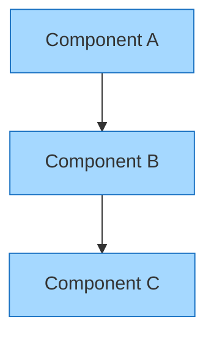

# InfoQ Article Writing Guide

## When to Use This Skill

Use this skill when:
- Writing research-driven architecture analysis
- Creating articles on industry trends and their implications
- Developing case studies from real organizations
- Explaining distributed systems and scalability patterns
- Analyzing software development trends pragmatically
- Targeting senior engineers, architects, and CTOs
- Submitting to InfoQ (editorial review platform)
- Building credibility with enterprise decision-makers

### Multi-Platform Strategy

When publishing same technical concept to multiple platforms (InfoQ, DZone, Medium, etc.):
- ✅ Use IDENTICAL code snippets linked to same GitHub repo
- ✅ Create UNIQUE title optimized for InfoQ (different from other platforms)
- ✅ Write UNIQUE content/narrative tailored to InfoQ's audience
- ✅ Match InfoQ's editorial style (research-driven, neutral tone)
- ✅ Different length/depth from other platform versions
- ✅ Different hook and call-to-action from other versions

**Example:**
- GitHub Repo: `microservices-patterns-java`
- InfoQ version title: "Event-Driven Microservices: Trade-offs and Real-World Implementation"
- DZone version title: "Building Event-Driven Systems: Practical Patterns for Production"
- Medium version title: "I Implemented Event-Driven Microservices—Here's What I Learned"
- All versions: IDENTICAL code from same GitHub repo

## InfoQ Platform Overview

**InfoQ** is a curated publication platform for software architects and senior engineers. Unlike Medium or Dev.to, InfoQ has:
- Editorial review and curation (accepts ~30-40% of submissions)
- Audience of 100k+ senior engineers and architects
- High-visibility newsletter feature
- 4-week exclusive publishing rights
- Strong industry authority and credibility
- Focus on pragmatic, research-backed analysis

## Article Specifications for InfoQ

### Length & Structure
- **Optimal length**: 2,000-3,000 words
- **Range**: 1,500-4,000 words max
- **Reading time**: 8-15 minutes
- **Sections**: 7-10 well-developed sections
- **Code ratio**: Minimal (5-10% max, diagrams instead)
- **Case studies**: 1-3 real organization examples

### Tone & Voice

**Editorial, analytical, research-informed**
- Neutral, objective tone (almost journalistic)
- Strong focus on why something matters to industry
- Evidence and data-driven reasoning
- Little to no personal storytelling
- Professional, credible voice

**Tone guidelines**:
- ✅ "The industry is shifting toward X, and here's why..."
- ✅ "Research shows that organizations using X see Y benefit..."
- ✅ "This architectural choice has trade-offs: A, B, and C..."
- ✅ "Based on case studies from Netflix, Airbnb, and Uber..."
- ✅ "The evidence suggests this approach works when..."
- ❌ Avoid: "I believe X is the future..."
- ❌ Avoid: Personal anecdotes or "I learned"
- ❌ Avoid: Hype or marketing language
- ❌ Avoid: "Everyone should do X"

## Diagram Requirements for InfoQ Articles

### Mermaid/PlantUML Diagrams (Always Include When Possible)

**RULE: Include Mermaid or PlantUML diagrams whenever conceptually relevant:**

✅ **ALWAYS create diagrams for:**
- Architecture or system design explanations
- Process flows or decision trees
- Data structures or relationships
- API interactions or request/response cycles
- State machines or workflow diagrams
- Sequence of events or timeline
- Comparison between approaches or patterns
- Component relationships or dependencies

✅ **Diagram types best for InfoQ articles:**
- Flowchart (process flows, decision trees)
- Sequence diagram (API/interaction flows)
- Architecture diagram (system design)
- State diagram (workflow/FSM)
- ER diagram (data models)
- C4 diagram (system architecture)
- Class diagram (OOP design)

**Diagram Quality Standards:**
- Beautiful, professional styling
- Readable and not cluttered (max 15-20 nodes)
- Clear labels for every element
- **Legend provided for all color/style meanings**
- Consistent color scheme matching article tone
- Easy to understand without external explanation
- Matches and reinforces article narrative

**Markdown syntax for embedding Mermaid diagrams:**
```markdown
## Section Explaining Concept



Legend:
- Blue boxes = Process components
- Solid arrows = Synchronous flow
```

### Creating Diagram Legends

**For every Mermaid/PlantUML diagram, include a legend:**

```markdown
### Legend

| Element | Meaning |
|---------|---------|
| Blue box | User interaction point |
| Green box | Successful operation |
| Red box | Error state |
| Solid arrow | Synchronous call |
| Dashed arrow | Asynchronous operation |
```

### Featured Image (Required)
InfoQ articles benefit from a professional featured image:

**Specifications:**
- **Dimensions**: 1024x768px (4:3 landscape) or similar landscape ratio
- **Format**: JPG recommended for web optimization
- **File size**: 500KB-2MB (optimized)
- **Content**: Professional, relevant to article topic
- **Style**: Clean, professional, technical aesthetic

**Image Generation Process:**
1. Use `image-generator-blog` skill to create featured image
2. Generate image related to main topic or key concept
3. Save to `/images` folder in article directory
4. Reference in markdown: ``

**Image Placement in Markdown:**
```markdown
# [Article Title]


[Article introduction begins here...]
```

### In-Article Images
Include 1-3 supporting diagrams or visualizations:

**When to use diagrams:**
- ✅ System architecture diagrams
- ✅ Concept flowcharts
- ✅ Comparison matrices or decision trees
- ✅ Timeline or evolution diagrams

**How to create:**
- Use `diagram-mermaid` or `diagram-plantuml` for technical diagrams
- Use `image-generator-blog` for custom graphics or comparisons
- Save all images to `/images` folder
- Use descriptive filenames: `diagram-architecture-pattern.png`

**Markdown syntax for in-article images:**
```markdown
## Section Title


*Figure 1: Description of what the diagram shows and its relevance.*
```

### Image Organization
```
article-directory/
├── README.md or article.md
└── images/
    ├── featured-image.jpg
    ├── diagram-architecture.png
    ├── diagram-process-flow.png
    └── comparison-matrix.png
```

## Article Structure for InfoQ

### Structure Template

```
HEADLINE (60-80 characters)
Editorial, analytical, specific

OPENING/CONTEXT (200-300 words)
- Industry trend or problem
- Why it matters now
- Scope and relevance
- Research or survey context

CORE ANALYSIS SECTION 1 (400-600 words)
- Main concept or approach
- Principles and reasoning
- Evidence or research supporting
- Industry context and relevance

CORE ANALYSIS SECTION 2 (400-600 words)
- Implementation considerations
- Architectural implications
- Trade-offs and decision criteria
- When it applies

REAL-WORLD CASE STUDIES (600-900 words)
- Case Study 1: Named organization, specific details
  * Context and challenge
  * Implementation approach
  * Results and metrics
  * Lessons for others

- Case Study 2: Different organization, different context
  * Similar or contrasting lessons
  * Key differences in approach
  * Business outcomes

- Case Study 3: (Optional) Additional perspective

CRITICAL EVALUATION (400-600 words)
- When this approach works
- When it doesn't work
- Limitations and caveats
- Future implications
- Not applicable scenarios

KEY TAKEAWAYS (200-300 words)
- Actionable insights for architects
- Strategic implications for teams
- When to consider this approach
- Next steps for organizations

REFERENCES & SOURCES (100-200 words)
- Research papers and studies
- Organization blogs/case study sources
- Technical documentation
- Related articles and resources

AUTHOR BIO (100-150 words)
- Professional background
- Current role/organization
- Expertise areas
- Contact/social info
```

### Five Key Takeaways (Required)

InfoQ requires **five key takeaways** as complete, actionable sentences (not bullet points):

**Format**:
```
Key Takeaway 1: [Complete sentence explaining concrete insight,
   benefit, or learning that architects can act on]

Key Takeaway 2: [Another complete sentence with specific,
   actionable information]

Key Takeaway 3: [Additional insight with clear context]

Key Takeaway 4: [Strategic implication for decision-makers]

Key Takeaway 5: [Guidance on when to apply or consider]
```

**Example**:
```
Key Takeaway 1: Event-driven architecture reduces coupling between
   microservices, enabling independent scaling and faster feature
   deployment in enterprise environments over 100+ engineers.

Key Takeaway 2: Organizations should implement event sourcing patterns
   when audit trails and temporal queries are business requirements,
   not as a default architectural choice for all systems.

Key Takeaway 3: The CAP theorem's trade-offs mean choosing between
   consistency guarantees and availability; Netflix chose availability
   while Airbnb prioritized consistency based on specific business needs.

Key Takeaway 4: Distributed tracing and observability are non-negotiable
   in event-driven systems; teams must invest in monitoring before
   complexity becomes unmanageable in production.

Key Takeaway 5: Most teams underestimate operational complexity; plan
   for debugging, monitoring, and incident response from day one,
   not as an afterthought after deployment.
```

## Topics That Work Well on InfoQ

### Software Architecture
- Microservices patterns and trade-offs
- Event-driven vs. request-driven architecture
- Distributed systems architecture
- System design at scale
- Serverless architecture analysis
- Cloud-native patterns

### Industry Analysis
- Emerging technology trends (AI, cloud, DevOps)
- Developer productivity research
- Security in distributed systems
- Performance optimization strategies
- Database scaling approaches

### Case Studies
- How Netflix scaled to millions of concurrent streams
- Airbnb's journey to microservices
- Amazon's architectural evolution
- Uber's infrastructure challenges
- Stripe's payment infrastructure
- Any large-scale system evolution

### Distributed Systems
- Consensus algorithms explained
- CAP theorem in practice
- Consistency patterns
- Data replication strategies
- Network partition handling
- Byzantine fault tolerance

### Practical Patterns
- Circuit breaker patterns
- Event sourcing implementations
- CQRS (Command Query Responsibility Segregation)
- Saga patterns for distributed transactions
- Stream processing architectures
- API gateway patterns

### Performance & Reliability
- Database scaling strategies
- Caching patterns and trade-offs
- Load balancing approaches
- Failure handling strategies
- Observability and monitoring
- Incident response patterns

## Research & Evidence Requirements

### What InfoQ Expects
- **Data-backed claims**: Benchmarks, metrics, research findings
- **Real examples**: Named organizations and specific implementations
- **Industry context**: Why this matters now
- **Trade-off analysis**: Honest assessment of pros/cons
- **References**: Links to studies, blogs, documentation
- **Practical guidance**: How architects should think about this

### How to Strengthen Your Article

1. **Include metrics**:
   - "Netflix reduced latency by 40%"
   - "System could handle 10x concurrent users"
   - "Development velocity increased 30%"

2. **Reference research**:
   - Link to academic papers
   - Cite industry surveys
   - Reference case study sources

3. **Provide specific examples**:
   - "At Airbnb with 100+ engineers..."
   - "Facebook's 500 million daily users..."
   - "Amazon with 1M+ transactions/second..."

4. **Explain trade-offs clearly**:
   - "Monolith: simpler but harder to scale"
   - "Microservices: complex ops, independent scaling"
   - "Serverless: no ops but cold start penalties"

## Content Quality Standards

### Technical Accuracy
- ✅ Verify all claims with data or references
- ✅ Test concepts where applicable
- ✅ Cite authoritative sources
- ✅ Include limitations and caveats
- ✅ Acknowledge when things are evolving/uncertain

### Clarity for Decision-Makers
- ✅ Explain "why" before "how"
- ✅ Provide context for business impact
- ✅ Be clear on when this applies
- ✅ Include organizational considerations
- ✅ Address team/process implications

### Originality & Perspective
- ✅ Bring unique angle or synthesis
- ✅ Add novel analysis or perspective
- ✅ Combine multiple sources into coherent view
- ✅ Provide fresh insights, not rehashing
- ✅ Original case study analysis or examples

## Submission Requirements

### What to Include in Email

**Send to**: editors@infoq.com

**Subject**: [Article Title] - InfoQ Submission

**Include in email body**:

1. **Proposed title**: [Exact headline]
2. **Target reader description**: [1-2 sentences on who this is for]
3. **Technologies discussed**: [List them clearly]
4. **Five key takeaways**: [As complete sentences]
5. **Article or outline**: [Full article or detailed outline]
6. **Author biography**: [100-150 words]
7. **Author contact**: [Email and social profiles]
8. **Timeline**: [If outline: expected completion date]

### Complete Submission Template

```
Subject: [Article Title] - InfoQ Submission

Target Reader: Senior architects at mid-to-large companies
   looking to evaluate [technology/pattern/approach]

Technologies: Kubernetes, microservices, cloud-native architecture

Key Takeaways:
1. [Complete sentence with specific insight]
2. [Complete sentence with specific insight]
3. [Complete sentence with specific insight]
4. [Complete sentence with specific insight]
5. [Complete sentence with specific insight]

[Full article text or detailed outline]

---

Author: [Your Name]
Bio: [100-150 word biography]
Email: [your.email@example.com]
LinkedIn: [your profile URL]
```

## Important Guidelines

### Required
- ✅ **Original content** - Not published elsewhere for free (InfoQ requires first-publication rights)
- ✅ **Editorial fit** - Timely, educational, practical, marketing-free
- ✅ **Five takeaways** - Must be complete sentences with specific, actionable insights
- ✅ **Author bio** - Professional background info (100-150 words)
- ✅ **No marketing** - Educational, not promotional or vendor-specific
- ✅ **Image rights** - You own or have permission for all images
- ✅ **AI disclosure** - Must disclose any generative AI usage

### Content Originality Policy
**CRITICAL**: InfoQ requires **original content not previously published** elsewhere for free access:
- ❌ **Not accepted**: Articles already published on Medium, Dev.to, blogs, LinkedIn for free
- ❌ **Not accepted**: Cross-posts from other free platforms
- ✅ **Acceptable**: Unpublished articles, original synthesis, unique analysis
- **Note**: After 4-week exclusivity period ends, you can republish with attribution

### AI Disclosure & Usage Policy
**Permitted AI uses** (must be disclosed):
- ✅ Brainstorming and ideation
- ✅ Feedback on drafts
- ✅ Grammar and clarity improvements
- ✅ Title/heading suggestions
- ✅ Support tool for research and outlining

**Disclosure requirement**:
- Disclose all AI tools used and their specific purposes in submission email
- Example: "I used Claude for grammar review and title suggestions on 3 drafts"
- Substantial AI-assisted articles receive standardized reader disclosure notices on publication

### Publishing Rights & Copyright
- **Exclusive**: InfoQ gets 4-week exclusive publishing rights from publication date
- **After 4 weeks**: You can republish on blog, Medium, Dev.to, LinkedIn, Substack
- **Attribution required**: Include proper attribution: *"This article was originally published on InfoQ on [date]"*
- **Copyright ownership**: You retain all copyright; InfoQ retains distribution rights
- **Infringement claims**: InfoQ may pursue copyright infringement claims on your behalf
- **Republishing limitations**: Summaries + links allowed; full reprinting of InfoQ articles elsewhere requires permission

### Image Copyright & Legal Liability
**CRITICAL RESPONSIBILITY**: You must own legal rights to all imagery:
- ✅ Original images you created
- ✅ Images with permissive licenses (CC0, Creative Commons, etc.)
- ✅ Images with written permission from copyright holder
- ❌ Screenshots of others' work without permission
- ❌ Images from Google Images without license verification

**Legal responsibility**:
- **Author assumes full legal and financial responsibility** for copyright compliance
- **Violations trigger**: Immediate article removal + potential scrutiny of future submissions
- **Risk**: Copyright claims, takedown notices, legal action from copyright holders
- **Best practice**: Document all image sources and permissions before submission

### Timeline Expectations
- Concept review: ~5 business days
- Technical review with feedback: 5-10 business days
- Revisions and approval: 5-10 business days
- Publication after approval: 1-3 weeks typically
- **Total**: 3-6 weeks from submission to publication

## Example: InfoQ Article Structure

### Article Title
"Distributed Event Processing at Scale: Learning From Netflix's 500M Daily Streams"

### Opening (Context)
As video streaming platforms scale to hundreds of millions of concurrent users, traditional request-response architectures break down. Netflix, Disney+, and YouTube process billions of events daily, each requiring immediate processing, aggregation, and analysis. This analysis examines how Netflix built its event-driven architecture, why event sourcing became critical, and the operational lessons applicable to enterprise systems at scale.

### Section 1: Industry Context
The shift toward event-driven architecture stems from specific business needs: real-time analytics, user experience personalization, and system resilience at global scale. Research from [cite study] shows organizations using event-driven approaches reduce time-to-insight by 60% and improve system resilience...

### Section 2: Architecture Patterns
Event-driven systems use publish-subscribe messaging to decouple producers from consumers. Netflix's architecture uses Kafka topics for [specific reason], enabling [specific benefit]. The trade-off is operational complexity: monitoring 100+ topics with millions of events/second requires sophisticated observability...

### Section 3: Netflix Case Study (Real Details)
At Netflix with 500M daily active users and 10k+ events/second per user, event processing became critical. They implemented [specific pattern] to handle [specific challenge]. Results: [metrics]. Key lesson: [insight]...

### Section 4: Additional Cases
Airbnb's approach [comparison and contrast]. Disney+ with different scale [different tradeoffs]...

### Section 5: Critical Evaluation
Event-driven architecture works when [criteria]. It doesn't work for [scenarios]. Common mistakes teams make: [specific pitfalls]...

### Section 6: Strategic Implications
For architects considering this approach: [guidance]. For CTOs planning infrastructure: [guidance]. For teams evaluating trade-offs: [guidance]...

## Example Headline
"Microservices at Scale: Trade-offs, Case Studies, and When They Actually Make Sense"

## Example Key Takeaways

```
Key Takeaway 1: Microservices enable independent scaling and
   deployment for large organizations with 50+ engineers, but
   introduce distributed systems complexity that requires
   sophisticated monitoring and operational maturity.

Key Takeaway 2: Successful microservices implementations require
   organizational alignment; Conway's Law dictates that system
   architecture mirrors the team structure that builds it.

Key Takeaway 3: The critical decision point is team size and
   organizational structure; companies with fewer than 50 engineers
   typically struggle with microservices operational overhead.

Key Takeaway 4: Distributed tracing, circuit breakers, and
   service mesh technologies are non-negotiable for managing
   microservices complexity in production environments.

Key Takeaway 5: Teams should evolve toward microservices from
   monoliths when organizational and operational maturity
   justify the increased complexity, not as initial architecture.
```

## Acceptance Tips

### What Increases Your Chances
- ✅ Write on trending, high-impact topics (AI, cloud, DevOps)
- ✅ Include 2-3 real case studies with specific details
- ✅ Provide data, metrics, or research backing claims
- ✅ Target architect/CTO audience explicitly
- ✅ Explain business and technical implications
- ✅ Polish writing and structure before submitting
- ✅ Comprehensive, actionable five takeaways
- ✅ Honest trade-off analysis

### What Decreases Your Chances
- ❌ Vague or generic topics
- ❌ No real examples or case studies
- ❌ Unverified claims without data
- ❌ Beginner-level tutorials
- ❌ Vendor marketing or promotion
- ❌ Rushed, unpolished writing
- ❌ Vague five takeaways
- ❌ No clear target audience

## Post-Publication Strategy

### Leverage InfoQ Publication
- Featured in InfoQ newsletter (~100k+ subscribers)
- Promoted on InfoQ social media
- May be featured on homepage or topic pages
- Attracts high-quality senior engineer audience
- Builds your credibility and authority

### Republish After 4 Weeks
- Share on your blog with "Originally published on InfoQ" attribution
- Post on LinkedIn with link to original
- Share on Medium with full attribution and link
- Share on Dev.to as "Cross-posted from InfoQ"
- Mention in your newsletter or social channels

### Long-Term Benefits
- Ranking for technical topics improves (InfoQ has strong domain authority)
- Your personal brand as architect/expert strengthens
- Attracts speaking invitations and consulting opportunities
- Content has long shelf life (InfoQ articles rank well for years)
- Establishes you as thought leader in your area

## Quality Checklist Before Submitting

- [ ] Article is 1,500-4,000 words (ideally 2,000-3,000)
- [ ] Addresses timely industry trend
- [ ] Educational and teaches non-trivial concepts
- [ ] Practical with actionable insights
- [ ] No marketing or vendor promotion
- [ ] Five key takeaways (complete sentences, not bullets)
- [ ] 2-3 real case studies with specific details
- [ ] Data/benchmarks supporting claims
- [ ] References and sources included
- [ ] Written for senior architects/CTOs explicitly
- [ ] Trade-offs clearly explained
- [ ] Professional, polished writing
- [ ] No grammatical errors
- [ ] All images have proper rights/permissions
- [ ] AI disclosure included (if applicable)
- [ ] Original content (not published elsewhere)
- [ ] Title is specific and editorial

## Common Mistakes to Avoid

❌ **Too beginner-focused**: InfoQ audience knows basics
❌ **No real examples**: Case studies are critical
❌ **Unverified claims**: Everything needs data or references
❌ **Marketing language**: Articles must be educational, not promotional
❌ **Vague takeaways**: Takeaways must be complete, actionable sentences
❌ **No personal voice**: Editorial doesn't mean impersonal; be authoritative
❌ **No business context**: Always explain why this matters
❌ **Overly technical**: Explain implications for decision-makers
❌ **No trade-offs**: Honest analysis of pros AND cons
❌ **Too long**: Stay within 4,000 words max

---

This skill works best combined with (in order of importance):
- **diagram-mermaid** - Create Mermaid diagrams (REQUIRED - use whenever conceptually relevant)
- **diagram-plantuml** - Create PlantUML diagrams (REQUIRED - for complex UML content)
- **image-generator-blog** - Featured images and custom graphics (REQUIRED)
- **architecture-diagram** - C4 and UML diagrams (recommended for architecture articles)
- **architecture-design** - Architectural patterns and system design explanations
- **code-examples-generator** - Code samples (minimal on InfoQ)
- **seo-optimizer** - Keyword research before writing
- **markdown-formatter** - Export and archiving

---

## Diagram & Image Generation Checklist for InfoQ

Before finalizing your InfoQ article:

**Mermaid/PlantUML Diagrams:**
- [ ] Mermaid or PlantUML diagrams included where conceptually relevant
- [ ] Each diagram has clear legend explaining colors/symbols
- [ ] Diagrams are beautiful, professional, and well-styled
- [ ] All labels are clear and descriptive (2-4 words max)
- [ ] No diagram exceeds 20 nodes (complexity kept reasonable)
- [ ] Diagrams match article narrative and reinforce key concepts
- [ ] Diagrams use consistent color scheme
- [ ] Diagram code is version-controlled in `/images/` as `.mmd` or `.puml` files
- [ ] If exported as images, files are optimized (100-200KB)

**Featured Image:**
- [ ] Featured image created and saved to `/images/featured-image.jpg`
- [ ] Featured image is 1024x768px (4:3 landscape ratio)
- [ ] Featured image compressed to 500KB-2MB

**Supporting Diagrams/Graphics:**
- [ ] 1-3 supporting diagrams/graphics created and saved to `/images/`
- [ ] All images referenced in markdown with relative paths: `./images/image-name.png`
- [ ] All images have descriptive alt text and captions
- [ ] All images compressed appropriately (100-200KB each)
- [ ] Image file names are descriptive and lowercase with hyphens

**Markdown Formatting:**
- [ ] Mermaid/PlantUML code blocks properly formatted:
  ````markdown
  ```mermaid
  [diagram code]
  ```
  ````
- [ ] All diagrams have accompanying legend explaining colors/notation
- [ ] Figure captions included:
  ```markdown
  

  *Figure 1: What this diagram shows and its relevance.*
  ```
- [ ] All images use consistent professional style/branding
